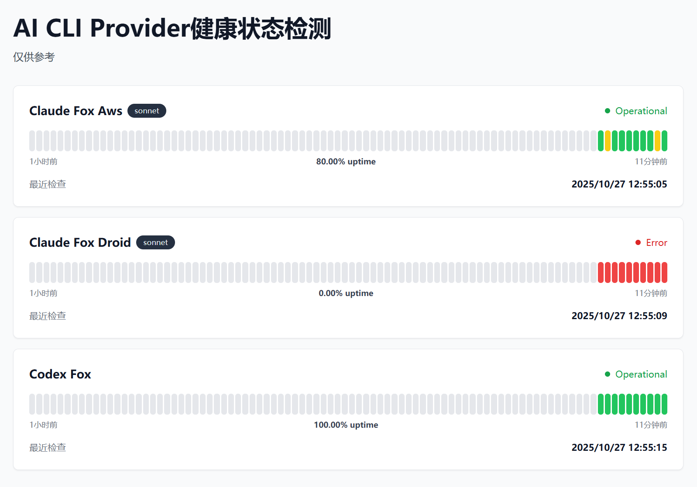

# Check-CX

> AI CLI Provider 健康检查与监控服务

一个专为 AI CLI 工具（Claude Code、Codex）设计的自动化健康检查系统，提供实时监控、状态追踪和可视化仪表板。

<p align="center">
  
</p>


## ✨ 特性

- 🤖 **多 AI CLI 支持** - 同时支持 Claude Code、Codex 
- 🧠 **智能检测** - 实际场景 QA 匹配，有效检测模型响应质量
- 💰 **成本优化** - 使用固定 projects + resume 形式，最大化缓存命中率
- 🚀 **稳定部署** - 服务启动自动配置初始化，减少交互提示阻塞
- ⏰ **灵活调度** - 每个节点可独立配置检查间隔
- 🔒 **安全设计** - 敏感信息自动脱敏，生产环境安全加固
- 🐳 **Docker 部署** - 开箱即用的容器化部署方案
- 💻 **现代化 UI** - 基于 React + TailwindCSS 的响应式仪表板

## 🏗️ 架构

```
check-cx/
├── src/                    # 后端服务
│   ├── core/              # 核心模块
│   │   ├── ServiceChecker.js    # 服务检查器（命令执行、会话管理）
│   │   ├── StatusStore.js       # 状态存储（数据持久化）
│   │   └── HealthMonitor.js     # 健康监控（定时任务、配置初始化）
│   ├── utils/             # 工具函数
│   └── server.js          # Express 服务器
├── frontend/              # 前端应用
│   ├── src/
│   │   ├── components/    # React 组件
│   │   ├── pages/         # 页面
│   │   └── lib/           # API 客户端
│   └── dist/              # 构建产物
├── config/                # 配置目录（挂载卷）
│   └── services.json      # 服务配置文件
├── template/              # 模板文件
│   ├── .claude.json       # Claude 配置模板
│   └── *.jsonl            # 会话历史模板
└── data/                  # 数据目录
    └── status.json        # 运行时状态数据
```

## 🚀 快速开始

### Docker 部署（推荐）

1. **克隆仓库**

```bash
git clone https://github.com/Nothing1024/check-cx.git
cd check-cx
```

2. **准备配置文件**

```bash
# 复制示例配置
cp config/services.json.example config/services.json

# 编辑配置文件
vim config/services.json
```

**配置文件字段说明：**

| 字段 | 说明 | 示例 |
|------|------|------|
| `id` | 服务唯一标识 | `claude-fox_aws` |
| `name` | 服务展示名称 | `Claude Fox Aws` |
| `type` | 服务类型 | `claude` 或 `codex` |
| `cwd` | 工作目录（相对路径） | `config/claude/fox_aws` |
| `command` | 执行命令模板 | `claude -p {prompt} --model {model}` |
| `params` | 命令参数 | 见下方示例 |
| `timeout` | 超时时间（毫秒） | `30000` |
| `expectedAnswer` | 期望响应 | `22` |
| `checkInterval` | 检查间隔（分钟） | `5`（默认值） |
| `enabled` | 是否启用 | `true` |

**完整配置示例：**
```json
{
  "services": [
    {
      "id": "claude-fox_aws",
      "name": "Claude Fox Aws",
      "displayName": "AI Assistant (AWS)",
      "type": "claude",
      "cwd": "config/claude/fox_aws",
      "command": "claude -p {prompt} --model {model}",
      "params": {
        "prompt": "20+2=?请你只回复数字",
        "model": "claude-sonnet-4-5-20250929"
      },
      "timeout": 30000,
      "expectedAnswer": "22",
      "checkInterval": 5,
      "enabled": true
    },
    {
      "id": "claude-fox_droid",
      "name": "Claude Fox Droid",
      "displayName": "AI Assistant (Droid)",
      "type": "claude",
      "cwd": "config/claude/fox_droid",
      "command": "claude -p {prompt} --model {model}",
      "params": {
        "prompt": "1+1=?请你只回复一个数字",
        "model": "claude-sonnet-4-5-20250929"
      },
      "timeout": 30000,
      "expectedAnswer": "2",
      "checkInterval": 3,
      "enabled": true
    },
    {
      "id": "codex-fox",
      "name": "Codex Fox",
      "displayName": "Code Assistant",
      "type": "codex",
      "command": "CODEX_HOME={codex_home} codex exec --skip-git-repo-check {prompt}",
      "params": {
        "codex_home": "config/codex/fox/.codex",
        "prompt": "1+1=?请你只回复一个数字"
      },
      "timeout": 30000,
      "expectedAnswer": "2",
      "checkInterval": 10,
      "enabled": true
    }
  ]
}
```

3. **复制供应商对应的.claude文件夹或.codex文件夹配置**

示例结构如下：

```
config/
├── claude/                    
│   ├── fox_aws/           
│   │   └── .claude        
│   │       ├── CLAUDE.md
│   │       ├── settings.json    
│   │       └── config.json
│   ├── fox_droid/           
│   │   └── .claude        
│   │       ├── CLAUDE.md
│   │       ├── settings.json    
│   │       └── config.json
└── codex/                    
    └── fox/           
        └── .codex        
            ├── auth.json
            ├── config.toml  
            └── version.json

```

4. **构建并运行**

**方式一：使用预构建镜像（推荐）**

项目已配置自动构建，可以直接从 GitHub Container Registry 拉取镜像：

```bash
# 拉取最新镜像（镜像名称会自动转为小写）
docker pull ghcr.io/lynnguo666/check-cx:latest

# 后台运行
docker run -d --rm --name check-cx \
  -p 30001:30001 \
  -v $(pwd)/config:/app/config \
  -e PROJECT_ROOT=/app \
  ghcr.io/lynnguo666/check-cx:latest
```

**方式二：本地构建镜像**

```bash
# 构建镜像
docker build -t check-cx:latest .

# 后台运行
docker run -d --rm --name check-cx \
  -p 30001:30001 \
  -v $(pwd)/config:/app/config \
  -e PROJECT_ROOT=/app \
  check-cx:latest
```

5. **访问服务**

打开浏览器访问：`http://localhost:30001`

### 本地开发

**注意：因claude code限制，所以运行脚本会涉及用户配置覆盖，本地开发前请备份好用户claude code配置！！！**

要求版本：NodeJS >= 22.21.0

1. **克隆**

```bash
git clone https://github.com/Nothing1024/check-cx.git
cd check-cx
```

2. **安装依赖**

```bash
npm install -g pnpm @anthropic-ai/claude-code@2.0.22 @openai/codex@0.45.0

bash install.sh
```

3. **配置服务**

参考 Docker 部署方式配置服务

4. **启动服务**

```bash
bash start-prod.sh
```

5. **访问服务**

打开浏览器访问：`http://localhost:30001`

## 📝 API 接口

### GET `/api/services`
获取所有服务概览

**响应示例：**
```json
{
  "services": [
    {
      "id": "claude-fox_aws",
      "name": "Claude Fox Aws",
      "model": "claude-sonnet-4-5-20250929",
      "currentStatus": "ok",
      "lastCheck": "2025-01-27T10:30:00.000Z",
      "recentChecks": [...]
    }
  ]
}
```

### GET `/health`
获取系统健康状态

### GET `/status.json`
获取完整状态数据（同 `/health`）


## 🤝 贡献

欢迎提交 Issue 和 Pull Request！

## 📄 许可证

MIT License

## 🙏 致谢

- [Claude Code](https://github.com/anthropics/claude-code) - Anthropic AI CLI
- [Codex](https://github.com/openai/codex) - OpenAI Code Assistant
